# DUBD

# [Deep Universal Blind Image Denoising](https://www.micc.unifi.it/icpr2020/) <br> ICPR 2020

Jae Woong Soh, and Nam Ik Cho

[Paper]

## Environments
- Ubuntu 18.04
- [Tensorflow](http://www.tensorflow.org/) (>=1.8) 
- CUDA 11.2 & cuDNN
- Python 3.7

## Abstract

Image denoising is an essential part of many image processing and computer vision tasks due to inevitable noise corruption during image acquisition. Traditionally, many researchers have investigated image priors for the denoising, within the Bayesian perspective based on image properties and statistics. Recently, deep convolutional neural networks (CNNs) have shown great success in image denoising by incorporating large-scale synthetic datasets. However, they both have pros and cons. While the deep CNNs are powerful for removing the noise with known statistics, they tend to lack flexibility and practicality for the blind and real-world noise. Moreover, they cannot easily employ explicit priors. On the other hand, traditional non-learning methods can involve explicit image priors, but they require considerable computation time and cannot exploit large-scale external datasets. In this paper, we present a CNN-based method that leverages the advantages of both methods based on the Bayesian perspective. Concretely, we divide the blind image denoising problem into sub-problems and conquer each inference problem separately. As the CNN is a powerful tool for inference, our method is rooted in CNNs and propose a novel design of network for efficient inference. With our proposed method, we can successfully remove blind and real-world noise, with a moderate number of parameters of universal CNN.
<br><br>

## Brief Description of Our Proposed Method

### <u>Probabilistic View</u>

<p align="center">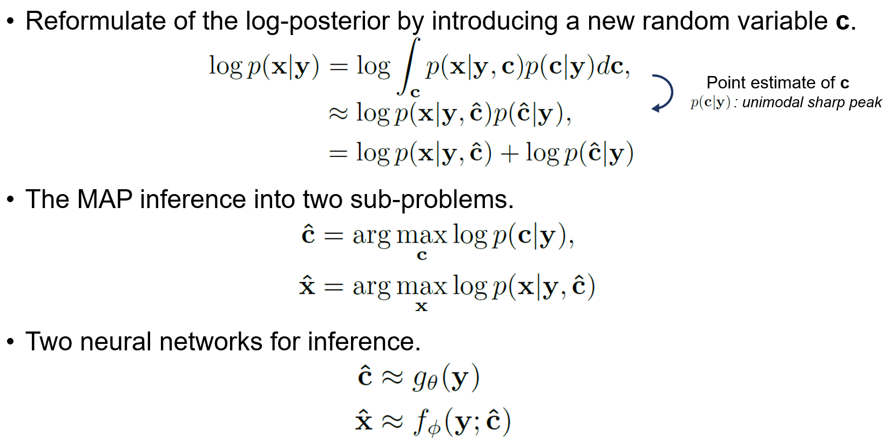</p>

* Notation: given noisy image <b>y</b> / latent clean image <b>x</b>

We reformulate the log-posterior by introducing a new random variable <b>c</b> that contains prior based on human knowlegde.
For approximation the integration, we use the point estimate for <b>c</b>, which is <b>argmax p(c|y)</b>.
When <b>p(c|y)</b> has a unimodal distribution with a sharp peak, the approximation is quite fair.
Then, we can solve the MAP estimate with the given point estimate. The problem can be reformulated into two sub-problems.
Two neural networks are employed for two inference sub-problems.

### <u> Conditional Estimation Network </u>

<p align="center">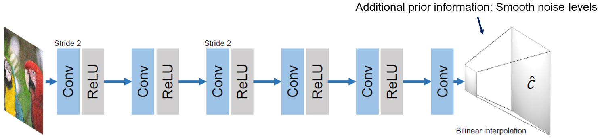

### <u> Tunable Denoising Network </u>

<p align="center">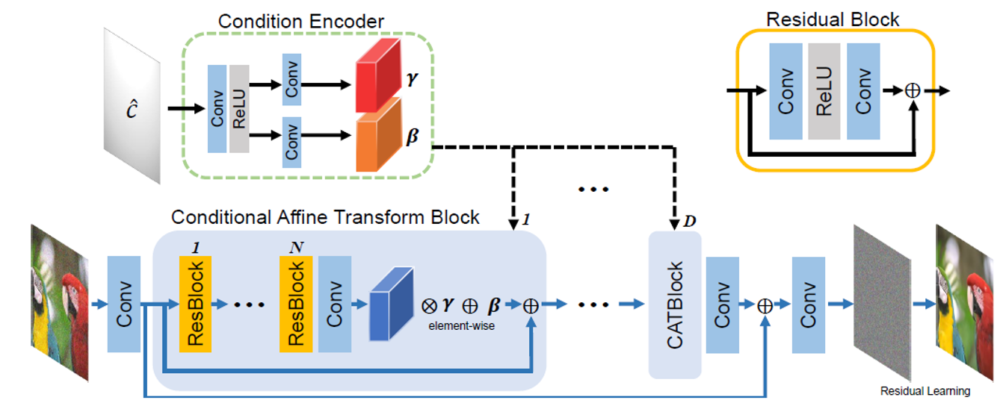


## Experimental Results

**Results on Additive White Gaussian Noise**

<p align="center">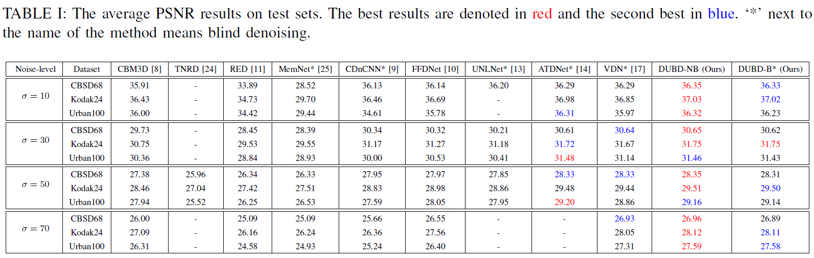</p>

**Parameter vs. PSNR**

<p align="center">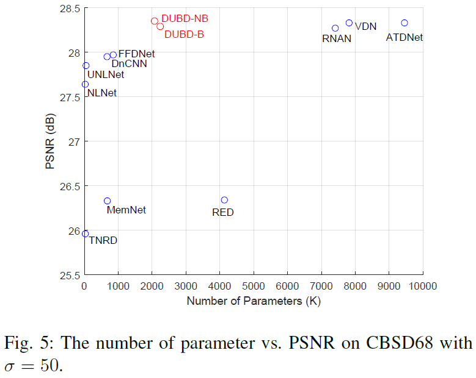</p>

**Spectrally, Spatially Variant Noise**

<p align="center">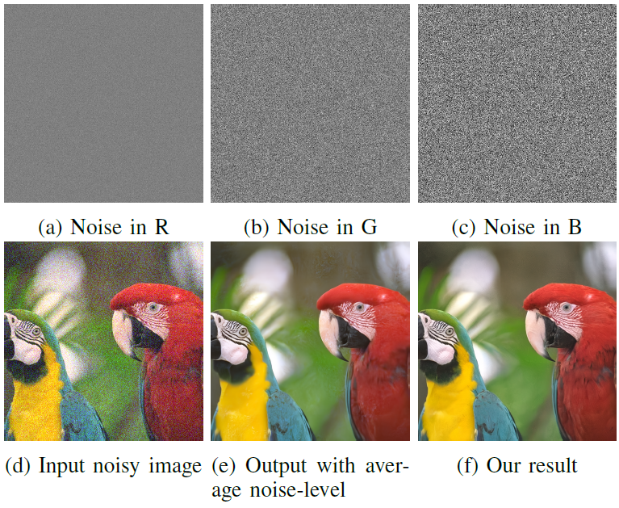&nbsp;&nbsp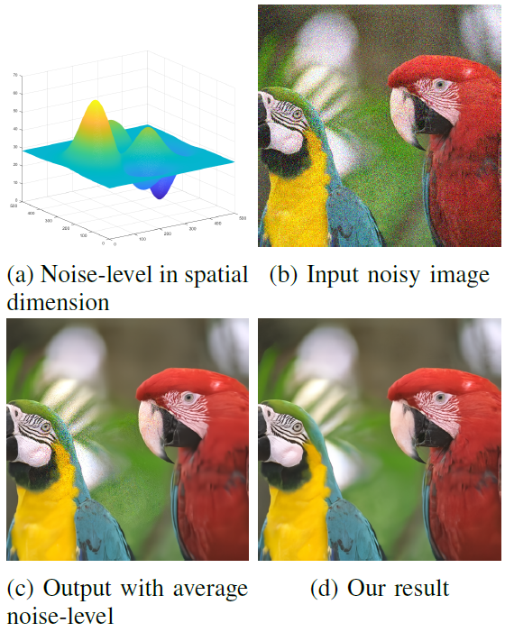</p>

* Left: Results on spectrally variant noise. Right: Results on spatially variant noise.

**Traversing Conditional Variable**
<p align="center">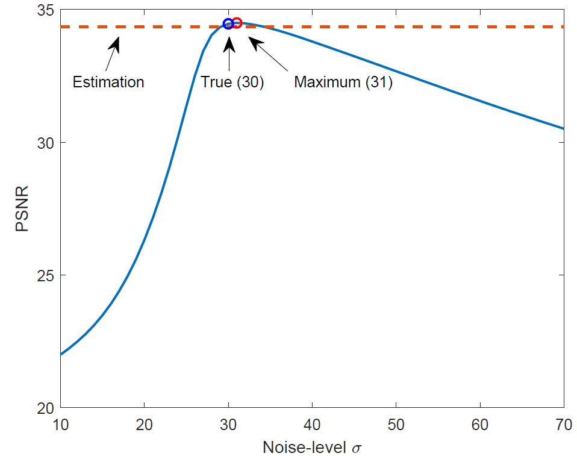</p>
<p align="center">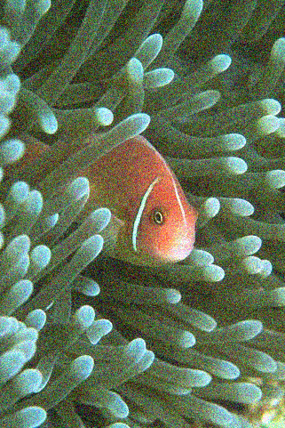&nbsp;&nbsp;</p>

Traversing the conditional variable on a noisy image with noise-level 30.

**Results on DND Benchmark (Real Noisy Images)**
<p align="center">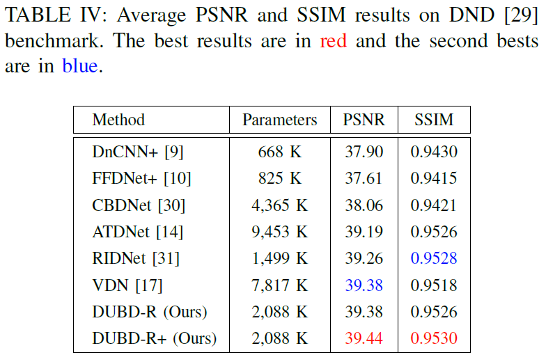</p>

## Visualized Results

<p align="center">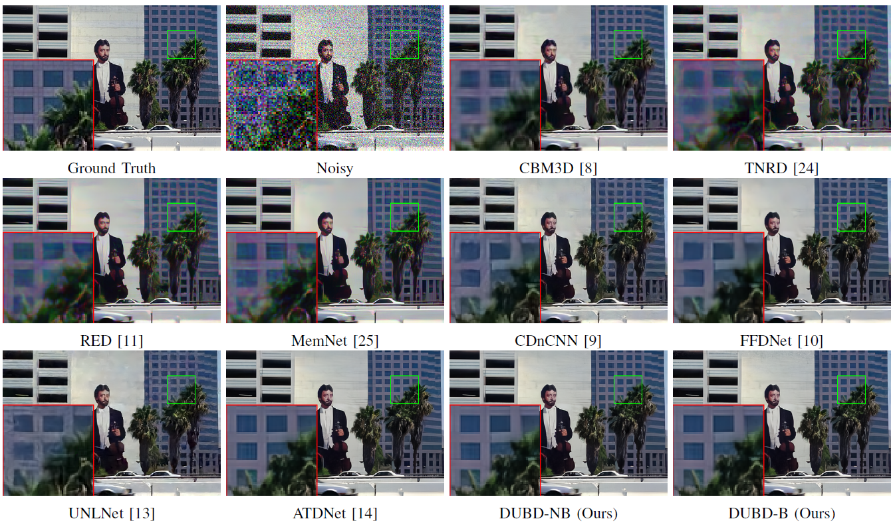</p>
<br><br>
<p align="center">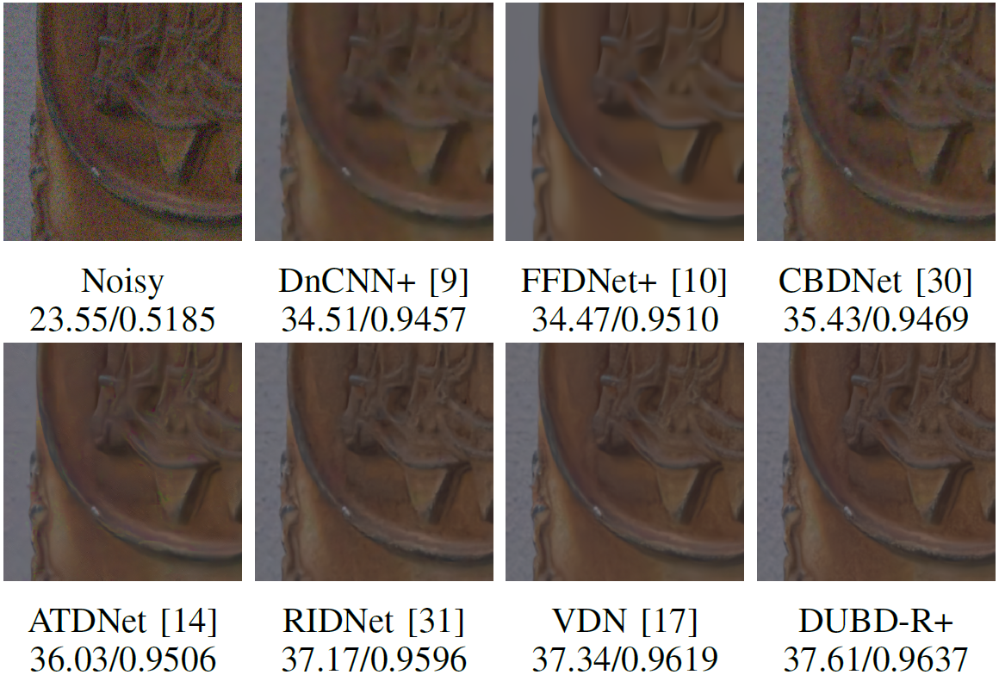</p>

## Guidelines for Codes

**Requisites should be installed beforehand.**

Clone this repo.
```
git clone http://github.com/JWSoh/DUBD.git
cd DUBD/
```
### Test

[Options]
```
python main.py --gpu [GPU_number] --sigma [noise-level] --inputpath [image path] --output [output path]

--gpu: If you have more than one gpu in your computer, the number designates the index of GPU which is going to be used. [Default 0]
--sigma: Noise-level of the Gaussian noise [Default: 10]
--inputpath: Path of input images [Default: testset/CBSD68]
--outputpath: Path for the output images. [Default: results/CBSD68]
```

## Citation
```
Will be updated soon.
```